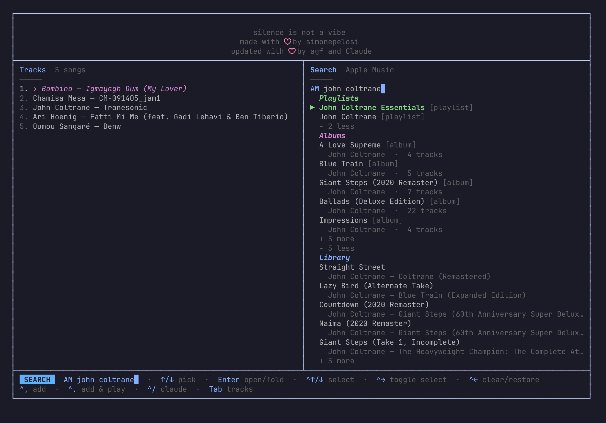
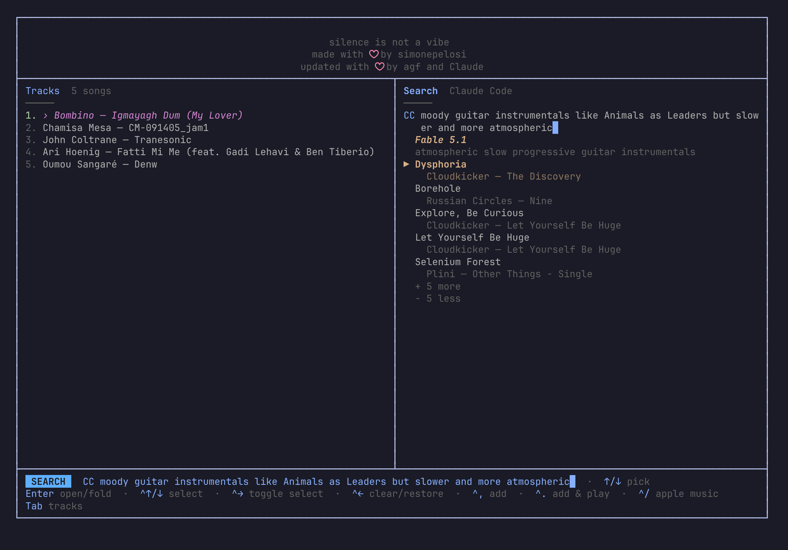
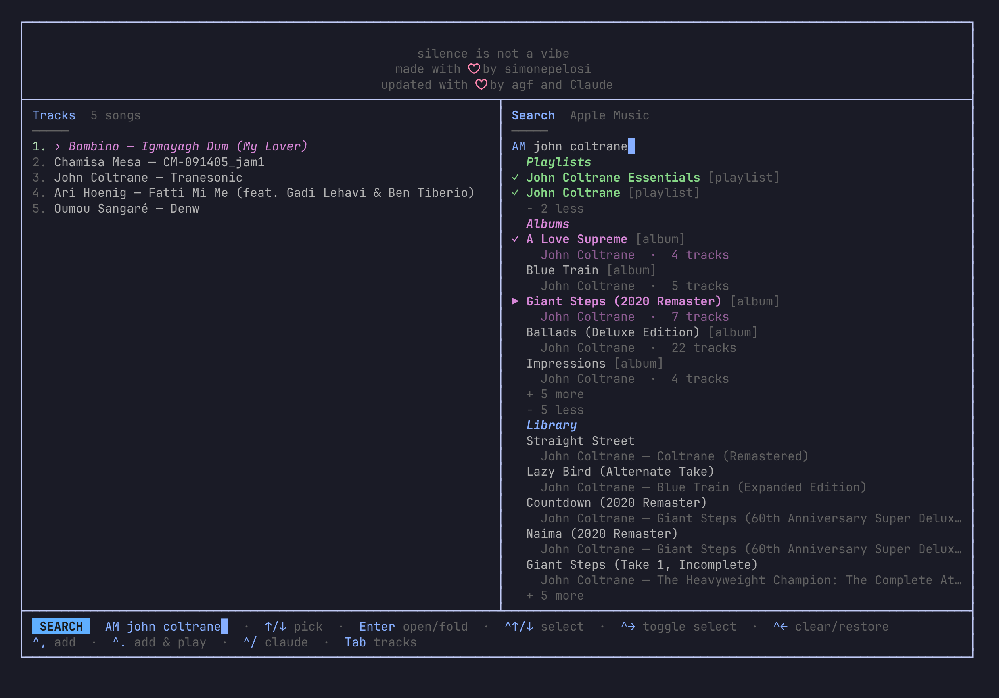

<p align="center">
  
</p>

<h1 align="center">♪ vibezAI</h1>

<p align="center">
  <strong>Apple Music in your terminal, with Claude Code as your DJ.</strong><br>
  A fork of <a href="https://github.com/simonepelosi/vibez">vibez</a> by Simone Pelosi.
</p>

<p align="center">
  <a href="https://github.com/angusforbes/vibezAI/blob/main/LICENSE"></a>
  <a href="https://github.com/simonepelosi/vibez"></a>
  <a href="https://github.com/angusforbes/vibezAI/blob/main/go.mod"></a>
</p>

[What it is](#what-it-is) · [Searching with Claude Code](#searching-with-claude-code) · [Saved lists](#saved-lists) · [Key bindings](#key-bindings) · [Installation](#installation) · [Configuration](#configuration) · [How it differs from vibez](#how-it-differs-from-vibez)

---

## What it is

vibezAI is a keyboard-driven Apple Music player for the terminal. Full tracks stream through a headless Chrome with Widevine, exactly as in vibez. What changed is the way you find and line up music: the screen is two columns, and the right one can hand your request to Claude Code.

<p align="center">
  
</p>

- **Tracks** (left) is the one list of what plays. It survives restarts, you move through it in place, and nothing you do in the right column ever replaces it.
- **Search** (right) has three sources, and `Ctrl+/` cycles them. `AM` searches Apple Music when you press `Enter`: Playlists, Albums, Library (your own copies) and Tracks, five per section, with `+ 5 more` / `− 5 less` rows and headers that fold. `CC` sends a plain-English description to Claude Code, which plans the search and ranks the results. `SV` lists the track lists kept with `:save`, the previous session's Tracks first, each a header that opens to all of its songs; add the whole list from its header or pick songs from it.
- **Tab** moves the keys between the two columns. The column that has them shows its title in bold; the mode text next to "Search" glows while a lookup is running.
- Everything that works in a column is listed once, in the footer.

## Searching with Claude Code

Press `Ctrl+'` to jump to the Search prompt and start typing (`Ctrl+/` switches the prompt between `AM` and `CC`). Type what you want to hear the way you would say it to a friend and press `Enter`.

<p align="center">
  
</p>

Two lookups from the day this was written, with the terms Claude came back with:

| You type | Claude's summary | Search terms it planned |
|---|---|---|
| `moody guitar instrumentals like Animals as Leaders but slower and more atmospheric` | Slow atmospheric progressive guitar instrumentals | Animals as Leaders · Plini instrumental · Intervals band · Chon · Polyphia slow songs · atmospheric post-rock instrumental |
| `dreamy 70s soul for a rainy sunday` | Dreamy 70s soul for rainy Sunday | Marvin Gaye I Want You · Minnie Riperton Perfect Angel · Isaac Hayes Hot Buttered Soul · Curtis Mayfield · Roberta Flack First Take · mellow 70s soul |

Other things that work well as prompts: an artist plus a direction ("early Radiohead but only the quiet songs"), an occasion ("brazilian jazz for cooking dinner"), an era and a feeling ("hopeful synth-pop from the mid 80s"), or a comparison ("bands that sound like Khruangbin but with vocals").

**What happens underneath**

1. **Plan.** The description goes to the Claude Code CLI (`claude -p`, no tools, no saved session) with a system prompt asking for four to six concrete Apple Music search terms: artists, songs, albums, at most two genre or mood phrases. It answers in JSON.
2. **Search.** Each term runs through the normal Apple Music search in parallel. Hits are interleaved term by term, deduplicated by artist and title, and pooled up to forty candidates.
3. **Rank.** The pool goes back to Claude with your description. It returns the best matches, up to fifteen, best first, favouring the mood, era and style you described and avoiding live, karaoke and tribute versions unless you asked for them.

The result appears as one section headed by the model that did the planning, with Claude's one-line summary under it. Everything in it is selectable and addable like any search result.

A lookup is two CLI calls, about seven seconds each with Fable 5.1 and roughly a cent in total; Sonnet is about twice as fast and a third of the price. `:model haiku` or `:model sonnet` switches, `:effort low` trims further, and both are remembered. When the CLI is unavailable, the built-in keyword table from vibez takes over and the header says so.

<p align="center">
  
</p>

Results, songs as well as whole albums and playlists, can be marked with `Ctrl+Shift+↑/↓` sweeps and `Ctrl+→` toggles and then added together with `Ctrl+,` or `Ctrl+.`.

## Saved lists

`:save road trip` keeps the Tracks panel as a list called "road trip". A bare `:save` names it for you, as in `2026-09-05_13-10_late night jazz`: the date and time, then two to four words Claude Code picks from the songs (without the CLI, the artist or genre that dominates them). Lists are plain files in `~/.config/vibez/tracklists/`, in the same format as `queue.json`, and the Tracks you had when you last quit are kept there too, as `last session`.

To use them, reach Search with `Tab` and press `Ctrl+/` until the prompt reads `SV`. Every list is a header with its size, `last session` first, then the newest saves. `→` opens one to all of its songs. `Ctrl+,` on the header adds the whole list to Tracks, on a song just that song, and `Ctrl+→` marks a header so a whole list joins a multi-selection. Adding never starts playback: with nothing playing, `space` starts what you have built. `Ctrl+Delete` on a header deletes the list, from disk and from the panel. Nothing here replaces Tracks; to start over from a list, clear Tracks with `c` first.

## Key bindings

### Tracks (left column)

| Key | Action |
|-----|--------|
| `space` | Play / pause |
| `↑` / `↓` | Move the highlight without changing playback |
| `enter` | Play the highlighted track; on the playing track, restart it |
| `q` | Put the highlight back on the playing track |
| `n` / `p` | Next / previous |
| `←` / `→` | Seek ±10 s |
| `d` | Remove the highlighted track |
| `D` / `ctrl+shift+d` | Cut everything from the highlight down / everything above it |
| `K` / `J` | Move the highlighted track up / down |
| `ctrl+/` | Cycle the Search source (`AM` → `CC` → `SV`) without leaving Tracks |
| `shift+↑` / `shift+↓` | Jump the highlight to the top / bottom |
| `R` | Insert five related songs after the highlighted track, once |
| `T` | Insert five random songs from your library after the highlighted track |
| `s` | Jump to a random track |
| `r` | Cycle repeat |
| `c` | Clear the list |
| `Tab` | Move the keys to Search |
| `ctrl+'` | Move the keys to Search and start typing into the `AM` or `CC` prompt |
| `:` | Command mode |
| `y` / `F` / `e` / `?` | Lyrics / feed / equalizer / about |

### Search (right column)

| Key | Action |
|-----|--------|
| `ctrl+'` | Start or stop typing into the prompt (`AM` and `CC`); nothing is looked up while you type |
| `ctrl+/` | Cycle the source: `AM` → `CC` → `SV` (saved lists) → `AM`; text already typed is looked up when switching to `CC`, `AM` waits for `enter` |
| `enter` | While typing: search (`AM`) or look up (`CC`) the text and stop typing. Otherwise: play the track highlighted in Tracks |
| `space` | Play / pause (not while typing) |
| `→` | Open or fold a section header (a saved list opens whole), grow or shrink a section by five |
| `ctrl+↑` / `ctrl+↓` | Move the highlight |
| `↑` / `↓` | Move the highlight in Tracks without leaving Search |
| `ctrl+shift+↑` / `ctrl+shift+↓` | Sweep-select: mark the highlighted item and everything passed over |
| `ctrl+→` | Toggle the highlighted item in or out of the selection |
| `ctrl+←` | Clear the selection; pressed again before anything changes, bring it back |
| `ctrl+delete` | `SV`: delete the highlighted list, from disk and from the panel |
| `ctrl+,` | Add the selection, or the highlighted item, to Tracks; never starts playback (with nothing playing, `space` starts the list) |
| `ctrl+.` | The same, and start the first song |
| `Tab` / `esc` | Move the keys back to Tracks; while typing, `esc` only stops typing |

Albums and playlists are expanded to their songs when added. An item already in Tracks is never added twice; it is highlighted there instead.

The two columns share their keys: while nothing is being typed, every Tracks key works from Search (`s`, `n`/`p`, `d`, `c`, `R`, `T`, …) and every Search key works from Tracks (`ctrl+↑/↓`, `ctrl+shift+↑/↓`, `ctrl+→/←`, `ctrl+,`, `ctrl+.`, `ctrl+/`). Each footer lists only its own column's keys.

### Command mode (`:`)

Typing `:` keeps both columns on screen and swaps the footer for the command list alone, each command with what it takes; type one and press `Enter`. `Tab` completes the first match, `esc` cancels.

| Command | Description |
|---------|-------------|
| `:model <fable\|sonnet\|haiku\|default\|id>` | Model Claude Code uses for `CC` lookups; bare `:model` shows the current one |
| `:effort <low\|medium\|high\|xhigh\|max\|default>` | Effort for those lookups |
| `:save [name]` | Save Tracks as a named list in `~/.config/vibez/tracklists/`; the lists appear in Search under `SV`. Without a name the list is dated and named after its songs by Claude Code (from the artists and genres when the CLI is not there) |
| `:quality <high\|standard\|256\|64>` | AAC bitrate |
| `:debug-logs` | Toggle the debug log, where Claude's terms and rankings are recorded |
| `:about` / `:donate` | About the app / support the original author |
| `:q` / `:quit` | Quit |

## Installation

vibezAI has no packaged releases; build it from source.

```bash
git clone https://github.com/angusforbes/vibezAI
cd vibezAI
PKG_CONFIG_PATH=$PWD/pkg-config go build -ldflags "-X 'github.com/simone-vibes/vibez/internal/version.Version=0.7.0+queue'" -o vibezAI .
install -m 555 vibezAI ~/.local/bin/vibezAI
vibezAI --no-update auth login      # Apple ID sign-in in a Chrome window
vibezAI --no-update                 # launch
```

**Requirements**

- Linux x86-64 (the setup this fork is developed on) · Go 1.26+ · WebKit/GStreamer development packages, or the `pkg-config` shim in the tree.
- An Apple Music subscription and a **MusicKit developer token** in `apple_developer_token` of `~/.config/vibez/config.json`. The upstream vibez releases embed the author's token; a build of this fork has none. Either build with your own key (`make build-with-token`, see upstream) or run the stock vibez release once, which writes its token to the config file.
- For `CC` lookups, [Claude Code](https://claude.com/claude-code) installed and logged in (`claude` on `PATH`). Without it, the `CC` prompt falls back to vibez's keyword table.

Pass `--no-update`: the self-updater would replace this fork with the upstream release.

## Configuration

`~/.config/vibez/config.json` (the directory name is unchanged from vibez):

| Key | Meaning |
|-----|---------|
| `vibe_agent` | `auto` (default: Claude when the CLI is installed, else keywords), `claude`, or `keywords` |
| `vibe_model` | Model passed to the CLI. Empty means `claude-fable-5-1`; `default` leaves the CLI's own choice |
| `vibe_effort` | `low` … `max`; empty leaves the CLI's default |
| `theme` | `default`, `dracula`, `gruvbox`, `nord`, or a custom theme in `~/.config/vibez/themes/<name>.json` |
| `audio_quality` | `high`/`256` (default) or `standard`/`64` |
| `album_art` | Album-art view on start |
| `wsl` | Audio workarounds for WSL2 |

Tracks are saved to `~/.config/vibez/queue.json` after every change and restored on the next start without auto-playing; at launch that list is also kept as the saved list `last session`. Named lists live in `~/.config/vibez/tracklists/`, one JSON file each.

## How it differs from vibez

vibezAI started from vibez 0.7.0. The engines, themes, equalizer, discovery and radio modes, Last.fm scrobbling and MPRIS integration are as upstream. The interface and the search are not.

| Area | vibez 0.7.0 | vibezAI |
|------|-------------|---------|
| Layout | Queue with a separate Queue panel, Library panel, Vibe panel and a header row | Two columns, Tracks and Search, and nothing else on screen |
| Queue | In memory only | Tracks persist to `queue.json`; navigated in place with `↑/↓`, `enter`, `d`, `D`, `K/J`; never replaced by a search; `:save` keeps named lists that Search offers under `SV` |
| Search | Single flat result list, `enter` plays and replaces the queue | Sections (Playlists, Albums, Library, Tracks) with `+ 5 more` / `− 5 less`, foldable headers, paging through Apple's results, duplicates never added |
| Vibe mode | `v` opens a prompt; a keyword table maps words to genres and dumps 15 shuffled songs into the queue | `CC` prompt inside Search; Claude Code plans the terms and ranks a pool of 40 candidates; results shown as a section headed by the model, nothing added until you say so |
| Adding | `enter` plays, `tab` adds, `shift+tab` plays next | `ctrl+,` adds, `ctrl+.` adds and plays; multi-select with `ctrl+shift+↑/↓` and `ctrl+→`, albums and playlists included |
| Related songs | Continuous radio | `R` inserts five related songs once |
| Library | Browser panel | `T` (shift+t) inserts five random library songs; the library is searched as part of every search |
| Saved lists | — | `:save [name]` keeps Tracks as a list, named by Claude Code when no name is given; Search offers the lists under `SV`, whole or song by song; `ctrl+delete` removes one |
| Footer | Changes with the mode | One fixed list per column; `:` swaps it for the command list |
| Model choice | — | `:model`, `:effort`, config keys |
| Name | vibez | vibezAI (binary, MPRIS identity, splash and About) |

The Go module path is still `github.com/simone-vibes/vibez` so that upstream changes merge cleanly.

## Audio engines

| Engine | Tracks | How it works |
|--------|--------|--------------|
| **Chrome + Widevine** | Full tracks | Chrome via Playwright; MusicKit JS + Widevine DRM |
| **WebKit + GStreamer** *(Linux fallback)* | 30 s previews | Embedded webkit2gtk-4.1; GStreamer decodes preview URLs |

Chrome is downloaded once to `~/.cache/vibez/chrome`; the Playwright driver lives in `~/.cache/vibez/driver`.

## Architecture

```
vibezAI/
├── cmd/                    # CLI entry points (cobra)
├── internal/
│   ├── config/             # config.json, queue.json path
│   ├── auth/               # MusicKit OAuth flow
│   ├── provider/           # Provider interface + Apple Music (search, paging, stations)
│   ├── player/             # cdp (Chrome/Widevine), webkit, gst, mpris
│   ├── queuestate/         # Tracks persistence
│   ├── tui/
│   │   ├── model.go        # Bubble Tea model, key handling, footers
│   │   ├── find_panel.go   # Search column: prompts, wrapping input
│   │   ├── queue_*.go      # Tracks navigation, related songs, library picks
│   │   ├── tracklists.go   # :save, automatic names, the saved-lists source
│   │   └── views/          # search sections + multi-select, now playing, lyrics, about
│   └── vibe/               # Planner + Reranker: Claude Code CLI, keyword fallback
└── pkg-config/             # webkit2gtk shim for building on Arch
```

## Credits and license

vibez is © Simone Pelosi, MIT licensed; if you enjoy the player, consider [supporting the original project](https://ko-fi.com/pelpsi). The changes in this fork are by Angus Forbes and Claude, under the same MIT license.
